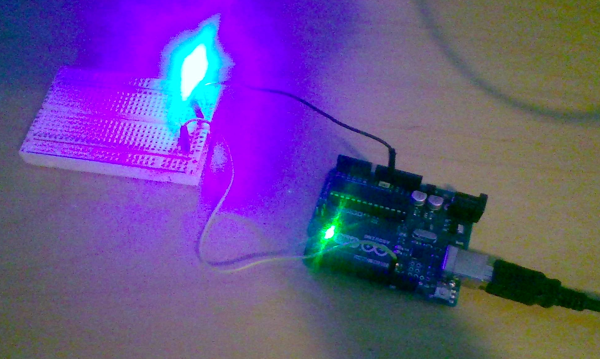
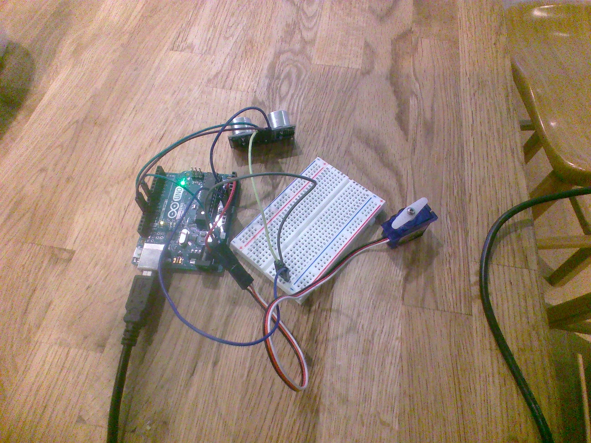

# Not-So-Basic-Arduino

## LED Blink Revisited

This was my first Arduino assignment. I had to make an LED Fade on and off.

[LED Blink Revisited]
https://create.arduino.cc/editor/FinnWimberley/5b6b91f8-97b5-40aa-ac85-d2b039ef2025

At the start I struggled a lot trying to figure out how to use Arduino Editor. I eventually figured out how to make it recognize that I had the Arduino plugged into my Chromebook. Once I did that I didn't have too much trouble making the LED blink but when I had to make it fade on and off I had a little more trouble. Then I figured out that I had to put in more lines of code and shorten the delay time in between them. Once I played around with that for long enough I found some values that worked and then I was done.

---

## Finite LED Blinker

For this assignment I had to make an LED blink five times and then stop.

[Finite LED Blinker]
https://create.arduino.cc/editor/FinnWimberley/6c2560ff-0819-494f-8df7-9a32b46de519

This assignment was a little similar to the last assignment because it involved making an LED blink, but it was a lot more complicated and difficult. I had to use "if" and "else" statements to tell Arduino to blink the LED if the counter was five or less and to stop blinking the LED if the counter was six or more.  I also had to make sure I made the delays long enough and in the right areas so that I was able to tell when it stopped blinking.  Like with the last assignment, after I played around with varying delay times in different areas, I eventually got it to look nice.

---

## Hello Functions

For this assignment I had to use functions to make the servo rotate based on information gathered by the ultrasonic sensor.

[Hello Functions]
https://create.arduino.cc/editor/FinnWimberley/d8cc3e68-0564-485b-9fe2-75d574ad8e53

This was the most challenging assignment yet.  It involved skilles that I learned in all the other assignment and learning how to use then together to make something work.  First I made a seperate sketch to figured out how to use the servo.  After that I made another sketch to figured out how to use the ultrasonic sensor.  Then I hooked up the servo and the ultrasonic sensor to the arduino at the same time.  I had to figure out how to make the outputs of the ultrasonic sensor the inputes of the servo, so I used an if statement and put a nice delay time.  Suprisingly after that I put my hand in front of the ultrasonic sensor and the servo started to rotate.

---

## Hello Functions

For this assignment I had to 

[NewPing]
https://create.arduino.cc/editor/FinnWimberley/f0011cec-e91f-4155-8e65-579b9e3700e6

Discription

---
