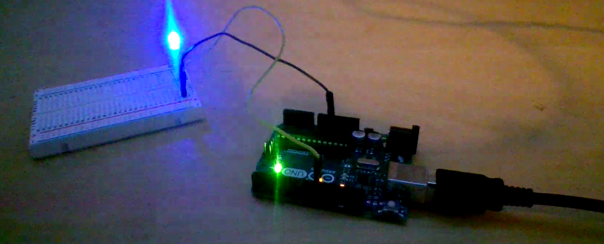

# Not-So-Basic-Arduino

## LED Blink Revisited

This was my first Arduino assignment. I had to make an LED Fade on and off.

[LED Blink Revisited]
https://create.arduino.cc/editor/FinnWimberley/5b6b91f8-97b5-40aa-ac85-d2b039ef2025

At the start I struggled a lot trying to figure out how to use Arduino Editor. I eventually figured out how to make it recognize that I had the Arduino plugged into my Chromebook. Once I did that I didn't have too much trouble making the LED blink but when I had to make it fade on and off I had a little more trouble. Then I figured out that I had to put in more lines of code and shorten the delay time in between them. Once I played around with that for long enough I found some values that worked and then I was done.

---
